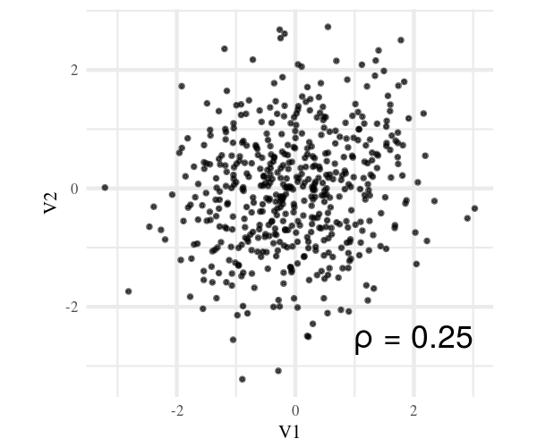

## Inference on species interactions is often very indirect
- Species interactions can be important for community and ecosystem structure from local to macroecological scales

- Competition is fluid, but studies often focus on only a few species at a time.

- Inference about competitive processes made with data that doesn't have a temporal dimension

## Inference on species interactions is often very indirect


## Inference on processes from static data is HARD
- Are communities in equilibrium? If not, results are biased.

- Zero inflation often biases results or lowers statistical power, because joint-absences hard to exclude from models.

- Missing environmental covariates cause correlations in residual occurrences.

- Models have a gazillion parameters and complicated structure

## Inference on processes from static data is HARD


## Idea
- Model correlations in abundance *changes* between species after controlling for the environment.

- Data from (permanent) plots at two points in time

- Significance testing by permutation or with JSDM

## Idea


## Advantages
- No need to estimate regression coefficients for environmental variables that can be assumed to have remained constant in time

- Ability to remove double-zero occurences without losing information

- Paired study design relaxes some model restrictions related to data distribution

- Inference about the full competitive interaction network instead of a small group of species

- **Temporally explicit data enables direct inference about processes**

## Example
- Simulated data: 100 species, 500 permanent plots, 2 temporal replicates
- Species increase and decrease jointly: correlation structure
- 2 scenarios, no missing data, half missing data
- Missing data corresponds to events where species was absent at both times.

```{r echo=FALSE, results="hide", message=FALSE, eval=FALSE}
## Simulate correlated abundance changes
set.seed(8981)
library(tidyverse)
library(matrixcalc)
library(Matrix)
library(clusterGeneration)
library(viridis)
theme_set(theme_minimal(base_size = 5, base_family = "Times"))
nspec <- 100

sampler <- function(sample){
    ind <- replicate(nspec,sample(1:NROW(sample), NROW(sample)))
    cor(sapply(1:nspec, function(x) sample[ind[,x],x]), use = "pairwise.complete.obs")
}

cortest <- function(nspec = 100, n = 500, missing = 0.5){
    mu <- rnorm(nspec, 0, 1)
    Sigma_cov <- genPositiveDefMat(nspec, covMethod = "onion", rangeVar = c(1,1))[[2]]
    cor_cor <- cov2cor(Sigma_cov)
    y1 <- mvrnorm(n=n, mu = rep(0,nspec), Sigma = diag(nspec))
    y2 <- y1 + mvrnorm(n=n, mu=mu, Sigma = Sigma_cov)
    changes <- y2-y1
    changes[sample(seq_along(changes), missing*length(changes))] <- NA
    estimates <- cor(changes, use = "pairwise.complete.obs")
    reps <- replicate(1000,sampler(changes))
    
    results <- list(
        upper = apply(reps, 1:2, function(x) quantile(x, 0.975, na.rm = TRUE)),
        lower = apply(reps, 1:2, function(x) quantile(x, 0.025, na.rm = TRUE))
    )
    
    results <- as.data.frame(sapply(results, function(x) x[lower.tri(x)]))
    results$true <- cor_cor[lower.tri(cor_cor)]
    results$means <- estimates[lower.tri(estimates)]
    results$var <- apply(combn(1:nspec, 2), 2, function(x) paste(x, collapse = "-"))
    results$residual <- results$means - results$true
    S_error <- sapply(results[c(3:4)], sign)
    results$S_error <- abs(rowSums(S_error)) != 2
    results$significant<- results$means > results$upper | results$means < results$lower
    return(results)
}

test1 <- cortest(100, 500, 0)
test2 <- cortest(100, 500, 0.5)

png("test11.png", res = 300, width = 600, height = 500)
ggplot(test1, aes(x = true, fill = S_error)) + geom_density(position = "fill") + geom_hline(yintercept = 0.05) + scale_fill_viridis(discrete = TRUE, begin = 0.8, end = .3, guide = FALSE) + labs(y = "Sign error rate", x = "True correlation")
dev.off()

png("test21.png", res = 300, width = 600, height = 500)
ggplot(test2, aes(x = true, fill = S_error)) + geom_density(position = "fill") + geom_hline(yintercept = 0.05) + scale_fill_viridis(discrete = TRUE, begin = 0.8, end = .3, guide = FALSE) + labs(y = "Sign error rate", x = "True correlation")
dev.off()

demmat <- matrix(c(1,0.25,0.25,1), ncol = 2)
cordem <- mvrnorm(500, mu = c(0,0), Sigma = demmat)
cordem <- as.data.frame(cordem)

png("cordem.png", res = 300, width = 600, height = 500)
ggplot(cordem, aes(V1,V2)) + geom_point(alpha = 0.6, size = 0.2) + annotate(x = 2, y = -2.5, label = "\U03C1 = 0.25", geom = "text", size = 3) + coord_fixed()
dev.off()
```

```{r optional_figs, echo=FALSE, eval=FALSE}
png("test12.png", res = 300, width = 600, height = 500)
ggplot(test1, aes(true, means)) + geom_point(alpha = 0.3, aes(color = factor(significant*S_error+significant)), size = 0.3) + scale_color_viridis(discrete = TRUE, begin = 1, end = 0, guide=FALSE) + labs(x = "True correlation", y = "Estimate")
dev.off()

png("test22.png", res = 300, width = 600, height = 500)
ggplot(test2, aes(true, means)) + geom_point(alpha = 0.3, aes(color = factor(significant*S_error+significant)), size = 0.3) + scale_color_viridis(discrete = TRUE, begin = 1, end = 0, guide=FALSE) + labs(x = "True correlation", y = "Estimate")
dev.off()
```

## No missing data, significant errors


## Half missing, significant errors


## How strong is that?


## Outline for method
1. Calculate expected occurrence change between t<sub1>1</sub> and t<sub>2</sub>
    - If changes are expected to be similar over study area, only intercepts needed
	- Otherwise include environmental covariates which influence trend
2. Calculate correlations among deviations from expected change
3. Permutate columns of n \times s abundance change matrix to produce null distribution of correlations
4. Compare observed correlations to e.g. 0.025 and 0.975 quantiles of null distribution

## I lack data. Let's collaborate?

[Konsta Happonen](https://twitter.com/koalha)

PhD candidate

University of Helsinki

Department of Geopraphy

[BioGeoClimate Modelling Lab](http://helsinki.fi/biogeoclimate)

konsta.happonen@helsinki.fi


## References {.smaller}
Damgaard, Christian, and Jacob Weiner. 2017. “Its About Time: A Critique of Macroecological Inferences Concerning Plant Competition.” Trends in Ecology & Evolution 32. doi:10.1016/j.tree.2016.12.001.

Harris, David J. 2016. “Inferring Species Interactions from Co-Occurrence Data with Markov Networks.” Ecology 97. doi:10.1002/ecy.1605.

Maestre, Fernando T., Ragan M. Callaway, Fernando Valladares, and Christopher J. Lortie. 2009. “Refining the Stress-Gradient Hypothesis for Competition and Facilitation in Plant Communities.” Journal of Ecology 97. doi:10.1111/j.1365-2745.2008.01476.x.

Ovaskainen, Otso, Nerea Abrego, Panu Halme, and David Dunson. 2016. “Using Latent Variable Models to Identify Large Networks of Species-to-Species Associations at Different Spatial Scales.” Edited by David Warton. Methods in Ecology and Evolution 7. doi:10.1111/2041-210x.12501.
